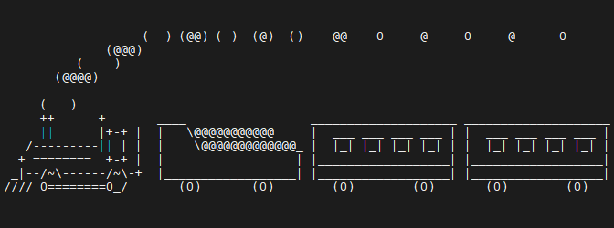

# Woche 1

## Tastenkombinationen

```
Strg + C
Strg + D
Strg + Shift + C        in das Clipboard kopieren
Strg + Shift + V        aus dem Clipboard einfügen
Strg + L                Bildschirm leeren
Tab                     automatische Vervollständigung
Pfeiltasten oben/unten  zuletzt benutze Befehle
man <befehl>            öffnet das Manual für den entsprechenden Befehl
```

## Beispiel für eine Package Installation

Das Programm sl (steam locomotive - Dampflokomotive) wird folgendermaßen installiert.

```bash
sudo apt install sl
```

Ruft man dann sl auf

```bash
/usr/games/sl
```

sieht man eine Lokomotive über den Bildschirm fahren:




## Debian Paktetverwaltung
Weiß man nicht genau, in welchem Debian Paket ein Programm enthalten ist, kann
man das Pakte mit Hilfe der [Debian-Paketsuche](https://packages.debian.org/index)

## Warum gibt es die Einträge . und .. in einem Verzeichnis?
In jedem Verzeichnis gibt es die beiden Einträge .  und .. :

```
.   verweist auf das aktuelle Verzeichnis
    cd .  :  es ändert sich nicht, ich befinde mich immer 
             noch im gleichen Verzeichnis
..  verweist auf das übergeordnete Verzeichnis (parent directory)
    cd .. : ich wechsele in das übergeordnete Verzeichnis
```

### Verzeichniseintrag ..
Angenommen ich befinde mich derzeit im Verzeichnis _/home/openhpi/linux_cli_ und gebe
dort die folgenden Kommandos ein ($ ist das Prompt (Eingabeaufforderung) der Shell. 
Die Zeichen nach dem $ sind die Eingaben, die Zeilen ohne $ am Anfang sind die 
Ausgaben)

```bash
$ pwd
/home/openhpi/linux_cli
$ find week1-dir -type d -print
week1-dir
week1-dir/dir3
week1-dir/dir2
week1-dir/dir2/.hidden
week1-dir/dir1
$ cd week1-dir/dir1
$ pwd
/home/openhpi/linux_cli/week1-dir/dir1
```

Jetzt möchte ich in das Verzeichnis _/home/openhpi/linux_cli/week1-dir_. Die
folgenden cd Kommandos kann man dazu nicht verwenden.

```
$ cd - : wechsele zurück in das letzte Verzeichnis (_/home/openhpi/linux_cli_)
$ cd   : wechsele in das Homeverzeichnis der Kennung  (_/home/openhpi_)
```

D.h. ich muss das folgende eingeben:

```bash
$ cd /home/openhpi/linux_cli/week1-dir
```

Mit Hilfe des Verzeichniseintrags .. kann ich aber kurz schreiben

```bash
$ cd ..
```

Vorteil: erstens ist diese Schreibweise kürzer - aber viel wichtiger: ich brauche
dabei den Namen des Verzeichnisses, in das ich wechseln will, nicht kennen.

#### Kuriose Ausnahme
Das Rootverzeichnis / eines Dateisystems enthält auch die Einträge . und ..
In diesem Fall verweisen sowohl . als auch .. auf /

### Verzeichniseintrag .
Der nutzen von .. sollte einigermaßen klar sein.

__Frage: warum braucht man den Eintrag . ?__

Beispiel: in meinem aktuellen Verzeichnis gibt es die ausführbare Datei hallo, die
beider Ausführung Hallo ausgibt.

Wenn ich den Namen einfach als Kommando in die Shell eingebe, passiert das Folgende:

```bash
$ hallo
-bash: hallo: command not found
```

Warum ist das so?  
Die Shell interpretiert hallo als auszuführendes Kommando. Das es kein in die Shell
eingebautes Kommando ist, muss sie wissen, wo im Dateisystem die Datei zu finden
ist. Dazu benutzt die Shell die Variable PATH

```bash
$ echo $PATH
/usr/local/bin:/usr/bin:/bin
```

Hier kann man mehrere durch : getrennte Verzeichnisse angeben. Im obigen Beispiel
würde die Shell in der folgenden Reihenfolge nach der Datei hallo suchen:

- /usr/local/bin/hallo
- /usr/bin/hallo
- /bin/hallo

Dabei gilt: der erste Treffer wird ausgeführt. Man kann natürlich das akutelle
Verzeichnis, in dem man sich befindet, zur Variabeln PATH hinzufügen:

```bash
$ PATH="$PATH:$(pwd)"
```
Aber das ist natürlich nicht immer sinnvoll.

Will man wissen, wo im Pfad ($PATH) das Kommando gefunden wurde, kann man das Kommando
_type_ nutzen:

```bash
$ type ls
ls is hashed (/bin/ls)
```

Nächster Versuch:

```bash
$ bash hallo
Hallo
```

Sieht gut aus, es kann aber auch das Folgende passieren:

```bash
bash hallo
hallo: hallo: cannot execute binary file
```

Warum?  
Beim Aufruf

```bash
$ bash hallo
```

erwartet die Bash, das die Datei hallo ein Bash Skript enthält.

Von welchem Typ meine ausführbare Datei ist (Shell Skript oder Programm), sieht
man mit dem folgenden Kommando:

```bash
$ file hallo
hallo: Bourne-Again shell script, ASCII text executable
```

```bash
$ file hallo
hallo: ELF 64-bit LSB pie executable, x86-64, version 1 (SYSV), dynamically linked, interpreter /lib64/ld-linux-x86-64.so.2, BuildID[sha1]=1dc10461ed0684ca195d2712ba9a0205d2989543, for GNU/Linux 3.2.0, not stripped
```

Ohne den Typ zu kennen, müsste man das Skript/Programm folgendermaßen aufrufen:

```bash
$ /home/openhpi/linux_cli/week1-dir/dir1/hallo
Hallo
```

Mit Hilfe des builtin Kommandos pwd in der Shell geht das auch so:

```bash
$ $(pwd)/hallo
Hallo
```

Da . auf das aktuelle Verzeichnis verweist, kann man aber auch einfach das Folgende
aufrufen:

```bash
$ ./hallo
Hallo
```

Sollen immer alle ausführbaren Dateien im aktuellen Verzeichnis von der Shell 
gefunden werden, kann man die Variable PATH folgendermaßen erweitern:

```bash
$ PATH="$PATH:."
```

Bleibt noch die Frage, warum

```bash
$ ./hallo
```

als Bash Skript ausgeführt wird.

Lösung: die Datei Datei sieht folgendermaßen aus:

```bash
$ cat hallo
#!/bin/bash
#
echo "Hallo"
```

Wichtig ist hierbei die erste Zeile:

```
#!/bin/bash
```

Diese Zeile wird als [Shebang](https://de.wikipedia.org/wiki/Shebang) bezeichnet.

Die Shell nimmt in diesem Fall an, dass die Zeichenkette nach "#!" ein Kommando ist.
Die Shell ruft dieses Kommando auf und übergibt den Rest der Datei an das Kommando.

### Weitere Informationen

- [Wikipedia: Dateisystem](https://de.wikipedia.org/wiki/Dateisystem)
- [Wikipedia: Inode](https://de.wikipedia.org/wiki/Inode)

## Daten für die Praktische Übung 1.9
Die Daten für die Praktische Übung 1.9 habe ich hier abgelegt:

- [week1-dir/](https://github.com/maroph/openhpi_linux-cli_2022/tree/main/samples/week1-dir)  
  Ausgepacktes Archiv
- [week1-dir.tar.gz](https://raw.githubusercontent.com/maroph/openhpi_linux-cli_2022/main/samples/week1-dir.tar.gz)  
  TAR Datei der Daten
- [week1-dir.zip](https://raw.githubusercontent.com/maroph/openhpi_linux-cli_2022/main/samples/week1-dir.zip)  
  Die original ZIP Datei

Auspacken der TAR Datei:

```bash
tar xvf week1-dir.tar.gz
```
finden.
